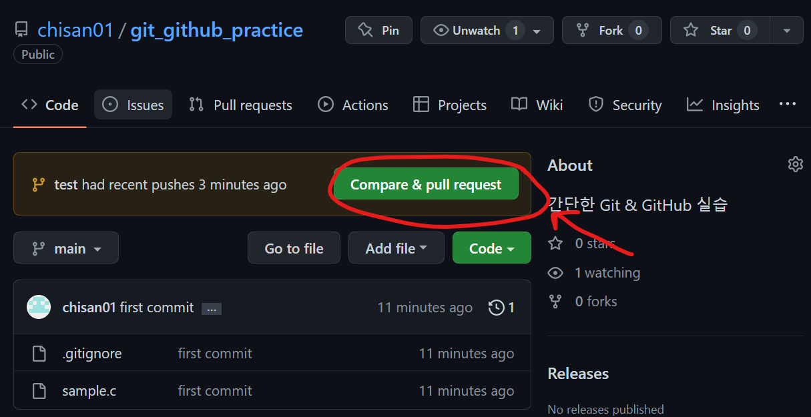
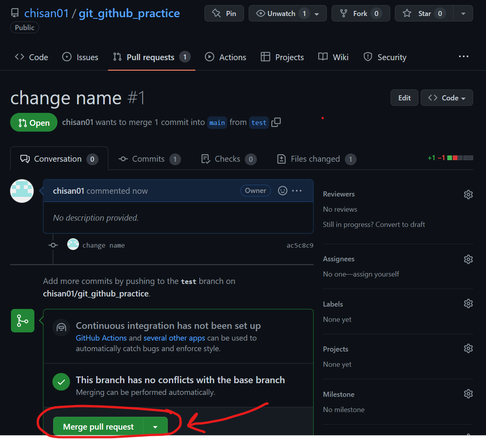
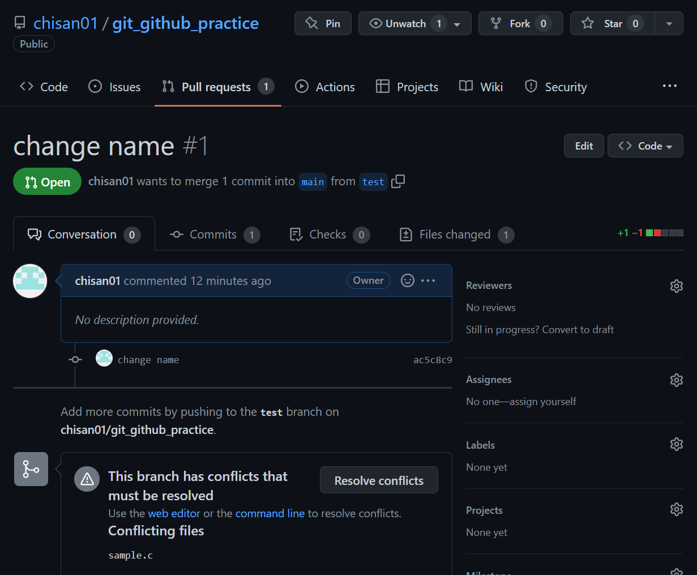
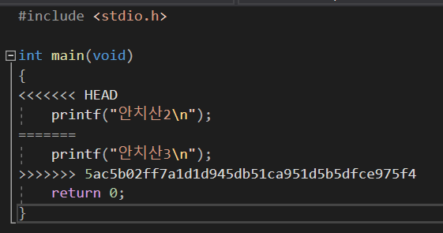
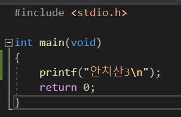
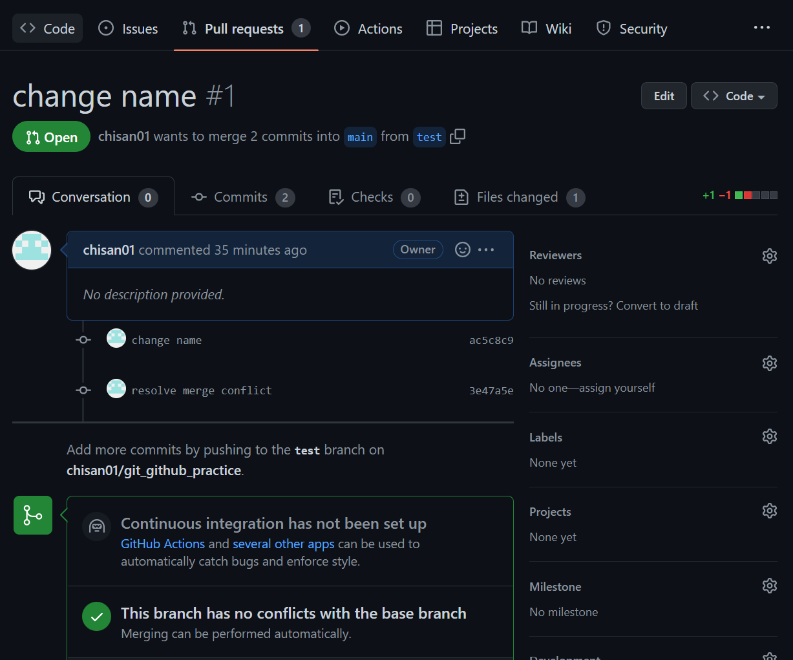

# GitHub Repository를 가지고 협업하는 방법

터미널 환경에서 명령어를 실행하는 방식으로 설명

> window에서는 git bash를 통해 명령어를 실행하면 된다.


<br>

* [기존에 진행중인 프로젝트를 GitHub Repository로 만드는 방법](./push-existing-repo.md)

* [협업을 진행하기 위한 초기 설정](./init-setting.md)

<br>

## 협업

> 주의: 모든 명령어는 프로젝트 폴더 안에서 실행되고 있는 Terminal을 통해 실행되어야 합니다.

<br>

### 1. upstream repository에서 pull 받아서 repository 최신화

```bash
git pull upstream main
```

<br>

### 2. 작업 후 commit

작업을 통해 변경된 내용 확인
```bash
git diff
```
commit할 파일, 폴더 선택
```bash
git status
git add <파일명 or 폴더명>
```
commit 생성
```bash
git commit -m "<커밋 메시지>"
```

<br>

### 3. origin repository에 push

```bash
git push origin main
```

<br>

### 4. GitHub에서 PR 생성 후 merge

1. GitHub에서 본인의 origin repository로 이동해서 `Compare & PullRequest` 버튼을 클릭해서 PR 생성 페이지로 이동합니다.

    

2. `Create pull request` 버튼을 눌러서 PR을 생성합니다.

3. PR을 통해 upstream에 변경될 내용을 확인 후, merge 합니다.

    

### 4-1. PR conflict



이때 간혹, 수정사항이 겹치면서 conflict가 발생해 merge가 불가능하다고 나오는 경우가 있는데 이럴 경우 다음과 같이 해결할 수 있습니다.

1. 로컬 환경에서 merge 수행
    ```bash
    git pull upstream main
    ```

    아마 다음과 같은 메시지가 나오면서 conflict가 발생되었다고 알려줄 것입니다.

    
2. 메시지를 보면 어디서 conflict 발생했는지 확인할 수 있고,
    > 예시 사진에서는 `sample.c`에서 발생했다는 것을 확인할 수 있습니다.

    해당 파일을 확인해보면 `>>>>>>>`이런 친구들을 확인할 수 있습니다.

    
    
3. conflict가 난 부분 중에서 merge 후 남겨둘 부분을 선택한 뒤, `>>>` 이런 부분을 모두 지우고 저장합니다.

    

4. 수정 사항을 커밋하고 나면 PR에서 conflict가 없어진 것을 확인할 수 있습니다.

    ```bash
    git add <커밋할 파일들>
    git commit -m "resolve merge conflict"
    git push origin main
    ```

    

<br>

### 추가 : `.gitignore` 파일

git을 사용하다보면 간혹 git에서 아예 볼수없도록 파일이나 폴더를 숨기는 것이 유용할 때가 생긴다.

대표적인 예로는 `visual studio`와 같은 IDE 설정 파일들은 협업할때 자주 충돌하기 때문에 이를 사전에 설정해주는 것이 편하다.

https://www.toptal.com/developers/gitignore

이런 사이트처럼 IDE, 사용 언어를 입력하면 자동으로 `.gitignore` 파일을 생성해주는 사이트도 있으니 이용해보자.

<br><br>

그리고 이 외에도 다양한 개념들이 있기 때문에 개발자를 목표로 하고 있다면 git과 github에 대해서 추가적인 공부를 해보는 것을 추천합니다.

* git branch
* git 브랜치 전략
* git reset
* git rebase
* ...

<br>

  